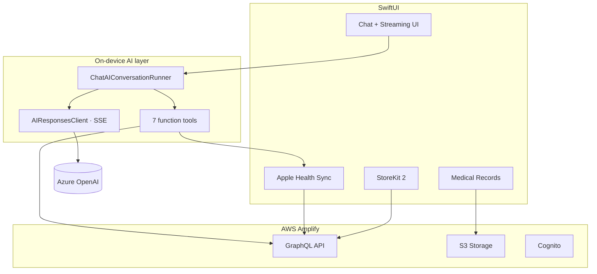

# Hi, I'm Oleksandr Meteliev

**iOS Engineer** · AI health products · real-time systems · App Store delivery

**Led iOS for [2ndOpinions](https://apps.apple.com/us/app/2ndopinions/id6560104742) on the App Store** · 23 feature modules · 400+ tests · SSE streaming · HealthKit · StoreKit 2

[LinkedIn](https://www.linkedin.com/in/oleksandr-meteliev-b2ab46209/) · [Case study](https://www.startupsoft.com/cases/2nd-opinion/)

---

### At a glance

| | |
|---|---|
| **Focus** | Production iOS — SwiftUI, streaming AI chat, HealthKit, medical workflows |
| **Flagship ship** | **2ndOpinions** — consumer health AI app (U.S. & Canada) |
| **Ownership** | iOS architecture, core features, App Store release, post-launch iteration |
| **Proof** | [App Store](https://apps.apple.com/us/app/2ndopinions/id6560104742) · [StartupSoft case study](https://www.startupsoft.com/cases/2nd-opinion/) |

---

## What I'm building now

### [2ndOpinions](https://apps.apple.com/us/app/2ndopinions/id6560104742) — AI health companion (iOS 17+)

Consumer health app that helps users prepare for doctor visits, explore health questions, and organize medical context through an AI-powered chat. **Shipped to the App Store** for the U.S. and Canadian market.

I own the **iOS product end-to-end**: architecture, core features, integrations, release pipeline, and post-launch iteration alongside product, backend, and ML teams.

#### Architecture (iOS)

#### What I built on iOS

**AI chat that feels live**  
Custom streaming layer on **Azure OpenAI Responses API** (SSE): real-time UI updates, **multi-turn tool-calling** (7 local tools), rate-limit retry, cancellation, and stream recovery.

**Context-aware medical conversations**  
- Semantic search across records, chat, files, medications, Apple Health  
- PDF/image attachments in conversation input  
- HealthKit sync (activity, heart, sleep, nutrition, mobility)  
- “Explore with AI” — attach medical records into active chat  

**Medical records as a first-class surface**  
Full workflow: capture, edit, filter, documents, **resilient S3 uploads** (background tasks, orphan recovery, batch reconciliation). **Coordinator**-driven module boundaries.

**Platform & monetization**  
StoreKit 2 · Amplify (Cognito, GraphQL, S3) · Firebase (FCM, Crashlytics) · Apple Speech voice input · SOAP summaries with PDF export.

**Scale & quality**  
**23 feature modules** · MVVM · SwiftData · `AppContainer` DI · **31 XCTest suites (400+ tests)**

`Swift` `SwiftUI` `async/await` `Combine` `SwiftData` `HealthKit` `StoreKit 2` `PDFKit` `AWS Amplify` `GraphQL` `Firebase` `SSE` `CryptoKit`

---

## Other shipped apps

| App | What it is |
|-----|------------|
| [EZLogz](https://apps.apple.com/us/app/ezlogz-eld-truck-navigation/id1171472456) | Fleet & logistics — cargo tracking, ELD/navigation |
| [EzChatAI](https://apps.apple.com/us/app/ezchatai-logistics-ai-chatbot/id6467775442) | AI assistant for drivers |
| [RomDomDom](https://apps.apple.com/ua/app/romdomdom/id1541853396) | Driving school — client + instructor apps |
| [Momenzo](https://apps.apple.com/us/app/momenzo-the-listing-video-app/id1465399598) | Video creation & sharing (SwiftUI) |
| **P2B** | Crypto exchange — WebSockets, Swift Package client |

---

## How I work

- **Product-minded** — release quality, edge cases (uploads, streams, account switching)  
- **Modular architecture** — features own UI/domain; shared code in services  
- **Honest scope** — I describe iOS work clearly; backend ML is collaborative  

---

**4+ years** · health-tech, fintech, logistics · **Lviv Polytechnic** · English B2 · Ukrainian native

*Production source is private. Happy to walk through architecture or technical decisions.*
